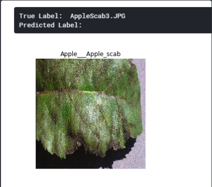

# Plant Disease Classifier

> Training a machine learning model to classify diseases plants.
> Trained on Kaggle using GPU. 

## Data:

* Obtained from Kaggle's [New Plant Disease dataset](https://www.kaggle.com/vipoooool/new-plant-diseases-dataset).
* Size: 1.33 GB
* The data has been augmented, as seen in the `plant-disease-classifier.ipynb` file.

## Methods:

The method used is transfer learning on [Inception V3](https://en.wikipedia.org/wiki/Inceptionv3).-

`ImageDataAugmentor` was also used to create an augmented dataset for increased training statistics.

## InceptionV3:
> Accuracy on Validation set: ~86%
> Optimizer: RMSprop

## The models in the given repository include:
* `inceptionv3_rmsprop.h5`

You can add your own model in the `Models` folder to be used.

## How to use the models?
> Run the `disease-pred.py` file to test the models on custom images.

## Example:
* The below example was taken during the training:

